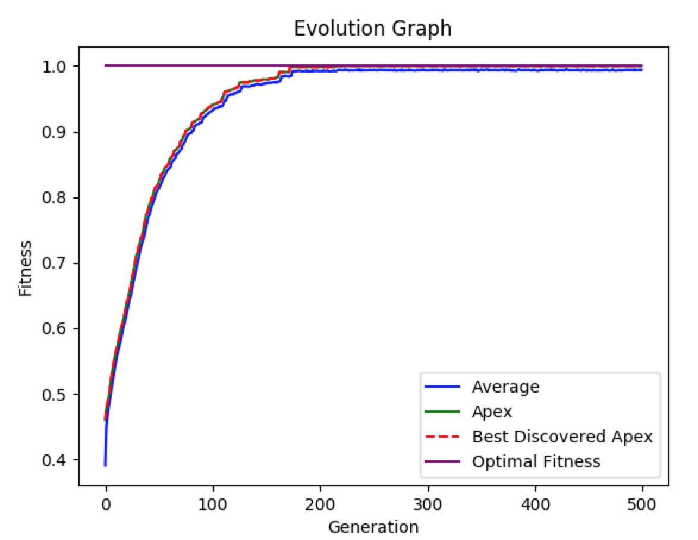

# EvoSchedule



**EvoSchedule** (aka evoschedule)  is an open source event-scheduling tool. It enables the user to create tasks along with preferences of when those tasks are best completed. Then a genetic scheduling algorithm is applied to "evolve" better and better schedules. The "fitness" of each evolved schedule is tested against the theoretical limit, produced by the **Hungarian Algorithm**. This software was developed as part of an Independent Study I took with Professor Amy Hoover at the **New Jersey Institute of Technology**.

This software uses an optional **Google Calendar** integration to update the user's **Google Calendar** with the optimal schedule.

## Getting Started

These instructions will get you a copy of the project up and running on your local machine for development and testing purposes. See deployment for notes on how to deploy the project on a live system.

### Prerequisites

[Python3.7](www.python.org/downloads) or newer.


### Installing

Clone this repo to your environment. Hit the download button or from the terminal type:
```
git clone https://github.com/TadayoshiCarvajal/EvoSchedule
```

You will need Google API credentials to utilize the **Google Calendar** integration. See [Setup](evoschedule/manual/README.md/#getting-credentials) in the [user manual](evoschedule/manual/README.md/) for further instructions.

## Deployment

Follow these instructions for a quick and dirty use of the code from within the project directory. For usage outside of the directory, you can simply copy the evoschedule directory into your target directory and make the necessary import statements in python, or add the evoschedule directory to your path so that the import statements can be made from anywhere.

Once you've downloaded or cloned a copy of `EvoSchedule` (see [Getting Started](#getting-started)), `cd` into the evoschedule directory:
```
$ cd the_path_to_the_evoschedule_directory/
```

`EvoSchedule` follows four essential steps, that use 5 different class objects: `GenomeBuilder`, `HeuristicBuilder`, and `EvolutionSimulator`. `GenomeBuilder` and `HeuristicBuilder` are used to generate a `Genome` object and `Heuristic` object which are given as parameters to the `EvolutionSimulator`. There is a fifth optional step. The steps are: 

1. Make a `GenomeBuilder` and `Genome`
2. Make a `HeuristicBuilder` and `Heuristic`
3. Make an `EvolutionSimulator` using the `Genome` and `Heuristic`
4. Run the `EvolutionSimulator`
5. Optionally, write to `GoogleCalendar` if you are happy with the results.

See the [manual](evoschedule/manual/README.md) for additional details.

## Built With

requirements.txt
```
cachetools==3.1.1
certifi==2019.11.28
chardet==3.0.4
cycler==0.10.0
google-api-python-client==1.7.11
google-auth==1.7.1
google-auth-httplib2==0.0.3
google-auth-oauthlib==0.4.1
httplib2==0.14.0
idna==2.8
kiwisolver==1.1.0
matplotlib==3.1.2
numpy==1.17.4
oauthlib==3.1.0
pyasn1==0.4.8
pyasn1-modules==0.2.7
pyparsing==2.4.5
python-dateutil==2.8.1
requests==2.22.0
requests-oauthlib==1.3.0
rsa==4.0
scipy==1.3.3
six==1.13.0
tqdm==4.40.0
uritemplate==3.0.0
urllib3==1.25.7
```

## Authors

* **Tadayoshi Carvajal** - *Initial work* - [TadayoshiCarvajal](https://github.com/TadayoshiCarvajal)

## License

This project is licensed under the MIT License - see the [LICENSE.md](pomcli/resources/LICENSE.md) file for details

## Acknowledgments

* Hat tip to Professor Amy Hoover, my mentor while I was creating this project, as well as the creators and contributors of scipy, python, tqdm, matplotlib, numpy, Google, and anyone else who assisted in making this project a reality. 