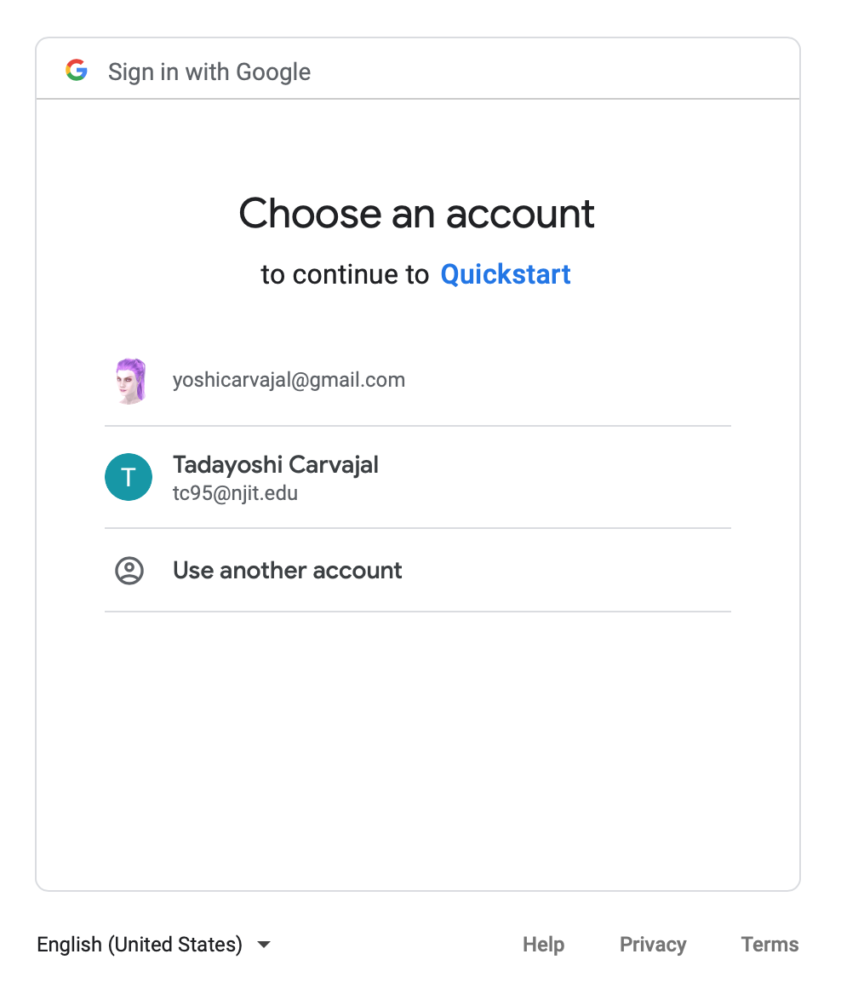

# EvoSchedule User Manual

**`Important Warning`: Do NOT use this application on your personal Google Calendar. Create another Google account that you can use for experimenting with EvoSchedule. This application can potentially delete all calendar events. You've been warned.**

**Topics:**

* [**Overview**](#overview)
    + [Prerequisites](#prerequisites)
    + [Installation and Setup](#installation-and-setup)
        + [installing](#installing)
        + [setup](#setup)
* [**Gene Scheduling**](#gene-scheduling)
    + [**Terminology**](#terminology)
    + [**Genome**](#genome)
        + [GenomeBuilder](#genomebuilder)
        + [Creating a Genome](#creating-a-genome)
    + [**Heuristic**](#heuristic)
        + [HeuristicBuilder](#heuristicbuilder)
        + [Creating a Heuristic](#creating-a-heuristic)
    + [**Evolution**](#evolution)
        + [GeneSequence](#genesequence)
        + [Generation](#generation)
        + [EvolutionSimulator](#evolutionsimulator)
        + [Running a Simulation](#running-a-simulation)
        + [Getting the Best Evolved Schedule](#getting-the-best-evolved-schedule)
        + [Getting the Optimal Schedule](#getting-the-optimal-schedule)
    + [**Google Calendar**](#google-calendar)
        + [Adding Events](#adding-events)


## Overview

> `Note`: The content of this manual applies to version `0.1.0`.

EvoSchedule, or evoschedule for convenience, is a tool built in python that allows users to optimally schedule tasks according to their `preferences`.

The concept is straightforward: The user decides a `time_scale` by which they want to plan their schedule. For now, we can choose `daily`, `weekly`, or `biweekly`. Then the user creates a dictionary with key-value pairs of **task : amount of time to spend on that task**. This dictionary
is conventionally called `time_per_task`.

The amount of time to spend on that task is per unit of `time_scale`, i.e., `time_scale`=`daily` means the amounts represent the number of minutes to spend on that task per day. Next, the user decides the minimum amount of time that they are willing to spend on a task before switching to another task. This is conventionally referred to as `min_task_time`.

Lastly, the user specifies their `preferences` by stating what times to avoid, are inconvenient, neutral, are convenient, are preferred, and are required for each task. This is used in the Hungarian Algorithm, and the genetic algorithm that are used to generate the optimal schedule.

### Prerequisites

[Python 3.7](www.python.org/downloads) or newer.

Congrats! You have all that you need to get started.

### Installation and Setup

> `Note`: As of version `0.1.0`, EvoSchedule has only been tested on macOS Catalina. This software is still in early beta, and there are no guarantees that this software will behave as intended, or work at all, on other operating systems, or even macOS Catalina.

#### Installing

Clone this repo to your environment. Hit the download button or from the terminal type:
```
git clone https://github.com/TadayoshiCarvajal/EvoSchedule
```

> `Note`: Keep track of where you installed the project.

Here are the contents of the **requirements.txt** file:
```
cachetools==3.1.1
certifi==2019.11.28
chardet==3.0.4
cycler==0.10.0
google-api-python-client==1.7.11
google-auth==1.7.1
google-auth-httplib2==0.0.3
google-auth-oauthlib==0.4.1
httplib2==0.14.0
idna==2.8
kiwisolver==1.1.0
matplotlib==3.1.2
numpy==1.17.4
oauthlib==3.1.0
pyasn1==0.4.8
pyasn1-modules==0.2.7
pyparsing==2.4.5
python-dateutil==2.8.1
requests==2.22.0
requests-oauthlib==1.3.0
rsa==4.0
scipy==1.3.3
six==1.13.0
tqdm==4.40.0
uritemplate==3.0.0
urllib3==1.25.7
```

You can manually install each of these or you can install all of them by using the following shell command:
```
$ pip install EvoSchedule/requirements.txt
```

> `Note`: This example assumes EvoSchedule is in the Desktop directory and the working directory is set to Desktop. You may need to specify the absolute path to the EvoSchedule directory depending on your working directory. 

#### Setup

Once you've downloaded or cloned a copy of EvoSchedule and its dependencies, we must do several things to get the full functionality this tool has to offer. If you are okay with not being able to write to your `Google Calendar`, you may skip ahead to [Gene Scheduling](#gene-scheduling).

First, we must obtain a `credentials.json` file for `Google Calendar API`. This can be obtained from the following link: [https://developers.google.com/calendar/quickstart/python](https://developers.google.com/calendar/quickstart/python). 

Scroll down, until you see:


Click on `Enable the Google Calendar API` and download the `credentials.json` file. Move/Copy `credentials.json` into the `credentials` directory inside of the `EvoSchedule/evoschedule/app` project directory.

**WARNING: do NOT use this app with your real Google Calendar. It has the power to delete or modify your entire calendar and the changes cannot be undone. Create a Google account for testing and demonstration purposes to keep your real itinerary safe. You've been warned.**

Now run the following:
```
$ python EvoSchedule/evoschedule/driver.py
```

A browser window will open and display the following:



Select the account that you wish to test `EvoSchedule` with and click the grey `Advanced` button. Click on `Go to Quickstart (unsafe)`. Grant the necessary permissions by clicking `Allow` until you see:


Now, use a text editor (I used VS Code in the following example) to edit `driver.py`:

```
$ open -a "Visual Studio Code" EvoSchedule/evoschedule/driver.py
```
You will see:
```python
    # Generate auth token and grant calendar permissions:
    gc = GoogleCalendar(None) # comment or remove after first time running.

    # Run a full system test using the daily test example data.
    #daily_test()
```
Delete or comment the line:
```python
    gc = GoogleCalendar(None) # comment or remove after first time running.
```

Congratulations! The application is now capable of writing the optimized schedule that it generates to your `Google Calendar`.

## Gene Scheduling


**Evolution** is the process by which all life on Earth has come to be. It can be algorithmically conceptualized as a brute-force search for organisms that are best suited to their environment. These organisms vary in their attributes, and these diverse attributes are encoded by the molecular structure known as DNA. To read more about how evolution works in the real world, you can start out with the Wikipedia article: [Wikipedia: Evolution](https://en.wikipedia.org/wiki/Evolution).

This project is very much influenced by the process of evolution. In my second year of university, I had the opportunity to take an Independent Study in Computer Science where the professor and I explored topics in Machine Learning as well as genetic algorithms. This project is the result of that class.

### Terminology
> `Note`: While some of the following terms may hold meaning in the realms of genetics and biology, they have been borrowed and adapted. Here is a list of those terms and what they mean within the scope of this project:

`gene` - A specific Task.

`allele` - A slot in which a `gene` may be placed.

`gene sequence` - A sequence of `alleles` and the `genes` that inhabit them.

`generation` - A collection of `gene sequences`.

`fitness` - A measure of how good a `gene sequence` is relative to the `Heuristic`. 

`apex` - The `gene sequence` with the highest fitness.

### Genome

From the doc string:

        """ An object which tells us information about what constitutes
        a valid sequence. A valid sequence will have the correct number of
        alleles and the correct quantity of genes per task."""

#### GenomeBuilder

`Genomes` are built with the `GenomeBuilder` class which takes the following parameters:

`time_scale` - str - one of 'daily', 'weekly', or 'biweekly'

`time_per_task` - dict - a mapping of tasks and the amount of time (in minutes) to schedule for each task.

 `min_task_time` - int - the minimum number of minutes to work on a task for.

#### Creating a Genome

Three rules must be adhered to when building a `Genome`:

1. The total time of the tasks in `time_per_task` must add up to the number of minutes specified by the `time_scale`, i.e., 'daily' will add up to 1440. You must use a task called `Free` to cover any remaining time.
2. Any amount of time in `time_per_task` must be evenly divisible by the `min_task_time`.
3. The `min_task_time` must not exceed the number of minutes in one day (1440).

Example of a valid `time_scale`, `time_per_task`, and `min_task_time`:
```python
    time_scale = "weekly"
    time_per_task = {
        "Free" : 480 * 9,
        "Work" : 480 * 5,
        "Sleep" : 480 * 7
    }
    min_task_time = 60
```

> `Note`: Notice how the total number of minutes adds to the number of minutes in one week, which is required since the `time_scale` is weekly, and all of the times are evenly divisible by the `min_task_time`.

`min_task_time = 60` means that our scheduler will never schedule a task for less than 60 minutes in one sitting. That is, every task will be scheduled for at least 60 minutes of consecutive time.

After specifying parameter values, the creation of a `Genome` is straightforward:
```python
    # Create the genome
    gb = GenomeBuilder(time_scale, time_per_task, min_task_time)
    genome = gb.get_genome()
```

### Heuristic

From the doc string:

        """ An object which tells us information about what constitutes
        a good sequence. A good sequence will have a fitness that is closer
        to the global maximum as given by the Hungarian Algorithm."""

#### HeuristicBuilder

`Heuristics` are built with the `HeuristicBuilder` class which takes the following parameters:

`genome` - Genome - a `Genome` object (see [Genome](#genome)).

`preferences` - dict - a mapping of priority given to each task for specific time slots.

The dictionary `preferences` is a nested dictionary. The first level has keys and values **task : dict**. The inner dictionary has keys and values **preference category : list[time_windows]**. Time windows are strings in the form "start_time-end_time" using AM/PM. 

If the `time_scale` is `daily`, then times only include the time, e.g.,  "09:00AM-05:00PM". 

If the `time_scale` is `weekly`, then times must be the day,time, e.g.,  "Monday,09:00AM-Monday,05:00PM".

If the `time_scale` is `biweekly`, then times must be the day#,time, e.g.,  "Sunday1,11:00PM-Monday2,05:00AM". Here Sunday1 refers to sunday of the first week in the biweek and Monday2 refers to the second Monday of the biweek.

> `Note`: times are zero padded so that hours and minutes each occupy 2 digits, e.g., 01:01PM is valid whereas 1:01PM is not.

#### Creating a Heuristic

Two rules must be adhered to when building a `Heuristic`:

1. The `Genome` and `Heuristic` must be compatible. That is, the tasks of the `Genome` must be exactly the same as the tasks of the `Heuristic`.
2. If a task has a window of time in its `required` preference, all other tasks must include that window of time in their `avoid` preference, and must not include that window of time in any other preference category.

Example of valid `preferences`:
```python
    preferences = {
        "Free" : {
            "avoid" : [ "Monday,09:00AM-Monday,05:00PM", 
                        "Tuesday,09:00AM-Tuesday,05:00PM", 
                        "Wednesday,09:00AM-Wednesday,05:00PM", 
                        "Thursday,09:00AM-Thursday,05:00PM", 
                        "Friday,09:00AM-Friday,05:00PM"],
            "inconvenient" : [],
            "neutral" : [],
            "convenient" :[ "Monday,06:00PM-Monday,08:00PM", 
                            "Tuesday,06:00PM-Tuesday,08:00PM", 
                            "Wednesday,06:00PM-Wednesday,08:00PM", 
                            "Thursday,06:00PM-Thursday,08:00PM", 
                            "Friday,06:00PM-Friday,08:00PM"],
            "preferred" : [],
            "required" : []
        },
        "Work" : {
            "avoid" : [],
            "inconvenient" : [],
            "neutral" : [],
            "convenient" : [],
            "preferred" : [],
            "required" : [ "Monday,09:00AM-Monday,05:00PM", 
                        "Tuesday,09:00AM-Tuesday,05:00PM", 
                        "Wednesday,09:00AM-Wednesday,05:00PM", 
                        "Thursday,09:00AM-Thursday,05:00PM", 
                        "Friday,09:00AM-Friday,05:00PM"],
        },
        "Sleep" : {
            "avoid" : [ "Monday,09:00AM-Monday,05:00PM", 
                        "Tuesday,09:00AM-Tuesday,05:00PM", 
                        "Wednesday,09:00AM-Wednesday,05:00PM", 
                        "Thursday,09:00AM-Thursday,05:00PM", 
                        "Friday,09:00AM-Friday,05:00PM"],
            "inconvenient" : [],
            "neutral" : [],
            "convenient" : [],
            "preferred" : [ "Monday,10:00PM-Tuesday,06:00AM",
                            "Tuesday,10:00PM-Wednesday,06:00AM",
                            "Wednesday,10:00PM-Thursday,06:00AM",
                            "Thursday,10:00PM-Friday,06:00AM",
                            "Friday,10:00PM-Saturday,06:00AM",
                            "Saturday,10:00PM-Sunday,06:00AM",
                            "Sunday,10:00PM-Monday,06:00AM"],
            "required" : []
        }
    }
```

> `Note`: Notice how Free and Sleep include in their avoid list the same windows of time that are in Work's required list.

After specifying parameter values, the creation of a `Heuristic` is straightforward:
```python
    # Create the heuristic
    hb = HeuristicBuilder(genome, preferences)
    heuristic = hb.get_heuristic()
```

### Evolution

Just as natural evolution is a process that is driven by natural selection, artificial evolution of sequences in EvoSchedule is driven by artificial selection.

#### GeneSequence

A `GeneSequence` is a sequence of `genes`. It is a wrapper class for the list containing the tasks that go at each of the time slot in the sequence, and provides some additional functionality.  

#### Generation

A `Generation` is a collection of `GeneSequences`. It is a wrapper class for the list containing the sequences and provides some additional functionality.  

#### EvolutionSimulator

The `EvolutionSimulator` is the object that is used to run the genetic algorithm. It takes 6 parameters:

`genome` - Genome - the `Genome` object. 

`heuristic` - Heuristic - the `Heuristic` object.

`n_generations` - int - the number of `Generations` to run in the simulation. Default is 200.

`seqs_per_gen` - int - the number of `GeneSequences` to include in each `Generation`. Default is 200.

`breed_rate` - float < 1.0 - the percentage of the `GeneSequences` that are used in the next generation. The sequences with the highest fitness are chosen. They multiply based on the reciprocal (multiplicative inverse). e.g. `breed_rate`=0.5 means the top 50% generate 2 copies of themselves in the following `Generation`.

`max_mutation_rate` - float < 1.0 - the maximum percentage of genes that are "mutated" in each sequence of the following `Generation`. A mutation in this algorithm is simply swapping two genes with one another within the same sequence. This is the maximum number of swaps as a percentage where the minimum is always 0, i.e., some sequences might not mutate at all from one `Generation` to the next.

#### Running a Simulation

Running a simulation follows this process:

1. Generate a random starting `Generation`
2. current `Generation` = starting `Generation`
3. Repeat `n_generations` time:
    
    4. Select the best sequences from the current `Generation` based on `breed_rate`
    5. Create the next `Generation` using the sequences from `Step 4`
    6. Mutate the sequences in next `Generation` based on `max_mutation_rate`
    7. current `Generation` = next `Generation`

The `EvolutionSimulator` abstracts these steps behind a simple to use run method.
First we create an `EvolutionSimulator` and call its `run` method.

```python
    evolution = EvolutionSimulator( genome, 
                                    heuristic,
                                    n_generations = 500,
                                    seqs_per_gen = 200,
                                    breed_rate = .05,
                                    max_mutation_rate = 0.01)

    evolution.run()
```

We can also print a graph that depicts the evolution process:
```python
    evolution.show_evolution_graph()
```

This launches a matplotlib graph window that looks like:


#### Getting the Best Evolved Schedule

The output of the `EvolutionSimulator.run` method is the best sequence that we are able to evolve in the simulation. To obtain it, we can simply assign it to a variable:
```python
    best_sequence = evolution.run()
```

We can view the schedule and fitness of this sequence like this:
```python
    print(best_sequence.get_schedule())
    print("fitness:", best_sequence.fitness)
```

#### Getting the Optimal Schedule

This problem is called the **Min-Cost Perfect Bipartite Matching Problem**, aka the **Assignment Problem**. It was studied and worked on extensively in the 20th century, when the first solution was publicized. Approximately one decade ago, historians discovered that the famous mathematician, Jacobi, found a solution almost 200 years ago, almost a century earlier than what was believed to be the earliest solution, and his solution was published posthumously. To learn more about the Assignment Problem or its most popular solution, the **Hungarian Algorithm**, check out their Wikipedia articles: [Assignment Problem](https://en.wikipedia.org/wiki/Assignment_problem) and the [Hungarian Algorithm](https://en.wikipedia.org/wiki/Hungarian_algorithm).

Our `Heuristic` object uses the **Hungarian Algorithm** to calculate the optimal schedule in **O(n^3)** time. We can also use this schedule, rather than evolve our way to it as such:

```python
    seq = heuristic.get_optimal_sequence()

    optimal_schedule = GeneSequence(seq, heuristic, None).schedule() # the list

    print(GeneSequence(seq, heuristic, None).get_schedule()) # the string
```

### Google Calendar

#### Adding Events

After following the steps in [Setup](#setup), we can easily add the schedules this app creates to our `Google Calendar`. To do this, we use a wrapper class called `GoogleCalendar` which serves as an interface between this package and the user's `Google Calendar`.

Create the `GoogleCalendar` object and add events:
```python
    gc = GoogleCalendar(time_scale, schedule=best_sequence.schedule())
    gc.add_events()
```

> `Note`: best_sequence is the `GeneSequence` object we obtained from evolution.run(). We can also use the optimal_schedule `GeneSequence` object from the previous section.

Congratulations! That's all that you need to know to use `EvoSchedule`. I hope that you found this manual useful.